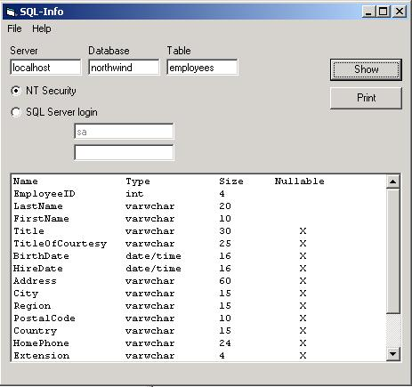



## SQL Info

### Description

This code connects to a given SQL server and database and returns field info from a specified table. Handy if you need a quick printout of a table definition and you don't have time or patience to wait until EM has launched and connected to the server.
 
### More Info
 

             |
---                |---
**Submitted On**   |2001-03-26 16:16:58
**By**             |[Networking\.be](https://github.com/Planet-Source-Code/PSCIndex/blob/master/ByAuthor/networking-be.md)
**Level**          |Intermediate
**User Rating**    |4.3 (13 globes from 3 users)
**Compatibility**  |VB 5\.0, VB 6\.0
**Category**       |[Databases/ Data Access/ DAO/ ADO](https://github.com/Planet-Source-Code/PSCIndex/blob/master/ByCategory/databases-data-access-dao-ado__1-6.md)
**World**          |[Visual Basic](https://github.com/Planet-Source-Code/PSCIndex/blob/master/ByWorld/visual-basic.md)
**Archive File**   |[CODE\_UPLOAD175893262001\.zip](https://github.com/Planet-Source-Code/networking-be-sql-info__1-21940/archive/master.zip)

